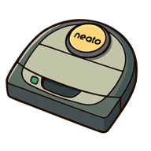

[](https://github.com/renjfk/OpenNeato/actions/workflows/ci.yml)
[](LICENSE)
[](https://github.com/renjfk/OpenNeato/releases/latest)
[](https://github.com/renjfk/OpenNeato/releases)

<p align="center">
 
</p>

# OpenNeato

Open-source replacement for Neato's discontinued cloud and mobile app. An ESP32 bridge communicates with
Botvac robots (D3-D7) over UART and exposes a local web UI over WiFi — no cloud, no app, no account required.

> [!NOTE]
> This is an early beta — things may break, rough edges are expected, and the API may change.
> If you run into problems, a [Discussion](https://github.com/renjfk/OpenNeato/discussions)
> or [issue](https://github.com/renjfk/OpenNeato/issues) is always welcome.

|                Dashboard                 |                  Manual Drive                  |                    Cleaning History                    |
|:----------------------------------------:|:----------------------------------------------:|:------------------------------------------------------:|
|  |  |  |

|                Clean Map                 |                Schedule                |                Settings                |
|:----------------------------------------:|:--------------------------------------:|:--------------------------------------:|
|  |  |  |

## Motivation

Neato shut down their cloud services and mobile app, leaving perfectly functional robot vacuums without remote
control or scheduling. OpenNeato brings them back to life with a small ESP32 board wired to the robot's debug
port, giving you a local web interface that works without any external dependencies.

## Features

- **Dashboard** with live robot status, battery level, cleaning state, WiFi signal, and storage usage
- **House and spot cleaning** with pause/resume/stop/dock controls that adapt to the current state
- **Manual driving mode** with a virtual joystick, live LIDAR map visualization, motor toggles (brush, vacuum, side
  brush), bumper/wheel-lift/stall safety warnings
- **Live cleaning map** — watch the robot's path during an active cleaning session in the History view, rendered on a
  canvas with coverage overlay
- **7-day cleaning scheduler** managed entirely on the ESP32 (doesn't use the robot's built-in schedule commands)
- **Cleaning history** with recorded robot paths rendered as coverage maps, session stats like duration, distance, area
  covered, and battery usage
- **Push notifications** via [ntfy.sh](https://ntfy.sh); get notified when cleaning is done, an error occurs, a
  maintenance alert triggers, or the robot docks; fully optional, configurable per event
- **OTA firmware updates** from the browser with SHA-256 download verification (against published `checksums.txt`), MD5
  transfer integrity, dual-partition layout with auto-rollback, and automatic new version notifications when a release
  is available on GitHub
- **Settings page** for hostname, timezone, motor presets, notification topics, UART pins, theme (dark/light/auto), and
  more
- **Event logging** with configurable log levels (off/info/debug), compressed JSONL files on LittleFS, browsable and
  downloadable from the UI; logging is off by default to minimize flash wear
- **Factory reset** via 5-second button hold on the ESP32 or from the settings page
- **Robot clock sync** — pushes NTP time to the robot automatically, re-syncs every 4 hours
- **Flash tool** — standalone CLI that auto-detects the USB port, downloads the correct firmware from GitHub Releases,
  and flashes with zero prerequisites
- **Safety watchdog** — auto-stops wheels in manual mode if the browser disconnects; task and heap watchdogs restart the
  ESP32 on hangs
- **Crash recovery** — orphaned cleaning sessions after unexpected reboots are automatically recovered with full stats

The frontend is a lightweight SPA that gets gzipped and embedded directly into the firmware binary, so a single
OTA update covers both firmware and UI. Mobile-friendly, dark theme by default.

## Supported Robots

Neato Botvac D3 through D7. D8/D9/D10 are NOT supported (different board, password-locked serial port).

## Installation

### Requirements

- ESP32-C3 or original ESP32 board with **4 MB flash** (any dev board with USB and exposed GPIOs)

### Quick Start

1. Download the latest release from the [Releases](https://github.com/renjfk/OpenNeato/releases) page
2. Flash the ESP32 using the flash tool (auto-detects your chip type):
   ```bash
   openneato-flash
   ```
3. Configure your home WiFi via the serial menu (opens automatically after flashing)
4. Wire the ESP32 to your robot's debug port
5. Open the web UI at `http://neato.local` or the IP shown in the serial monitor

For detailed instructions and troubleshooting, see the [User Guide](docs/user-guide.md).

### Building from Source

Requires [Node.js](https://nodejs.org/) 22+, [PlatformIO CLI](https://platformio.org/install/cli),
and [Go](https://go.dev/) 1.26+.

```bash
git clone https://github.com/renjfk/OpenNeato.git
cd OpenNeato

# Build frontend (generates web_assets.h)
cd frontend && npm ci && npm run build && cd ..

# Build firmware
pio run -e c3-release

# Build flash tool
cd flash && go build -o openneato-flash . && cd ..
```

## Contributing

OpenNeato is open to contributions and ideas! Whether you're a developer wanting to add features or a user with
suggestions, your input is valuable.

> [!TIP]
> Before opening an issue, consider starting a
> [Discussion](https://github.com/renjfk/OpenNeato/discussions) first — many questions,
> setup troubles, and ideas are easier to resolve through conversation.

### Issue Conventions

When creating issues, please follow our simple naming convention:

**Format:** `type: brief description`

#### Issue Types

- `feat:` - New features or functionality
- `fix:` - Bug fixes
- `enhance:` - Improvements to existing features
- `chore:` - Maintenance tasks, dependencies, cleanup
- `docs:` - Documentation updates
- `build:` - Build system, CI/CD changes

#### Examples

- `feat: add CSV export functionality`
- `fix: app crashes when importing large files`
- `enhance: improve data loading performance`
- `chore: update dependencies to latest versions`
- `docs: update README with installation instructions`
- `build: update Xcode project settings`

#### Guidelines

- Use lowercase for the description
- Be specific and actionable
- Keep under 60 characters
- No period at the end

## Development

### Release Process

Manual releases via opencode; see [RELEASE_PROCESS.md](RELEASE_PROCESS.md).

Prereleases can be triggered from any PR by commenting `/prerelease` (collaborators only).

## License

This project is licensed under the [MIT License](LICENSE).
