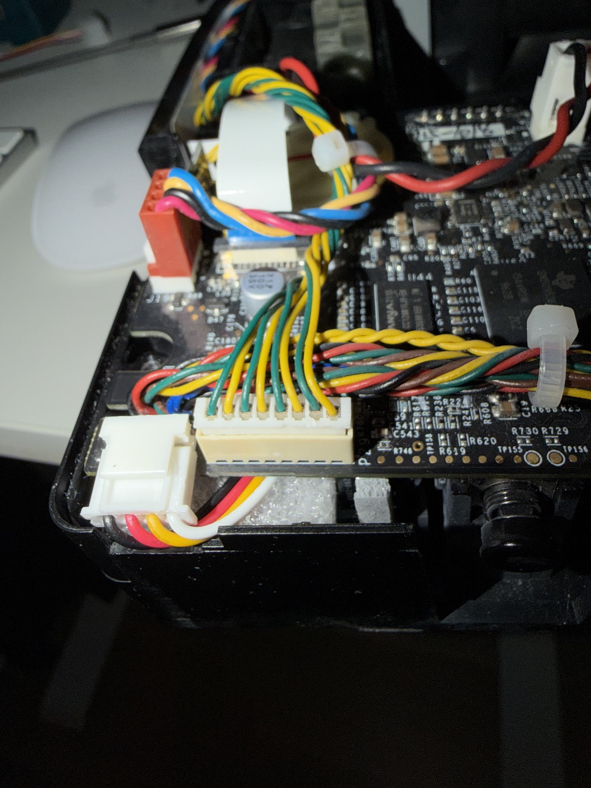
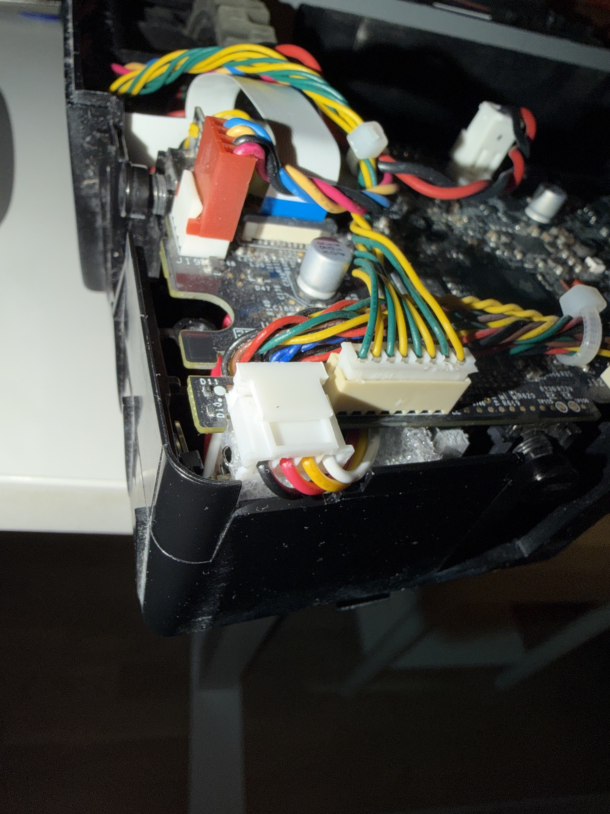
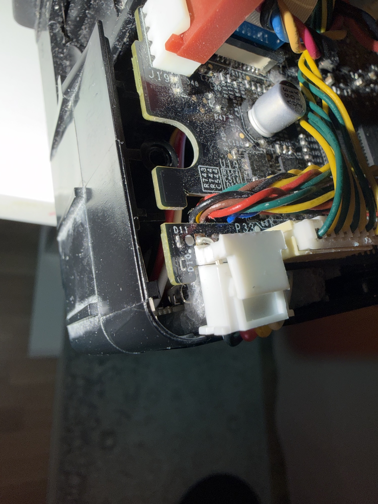
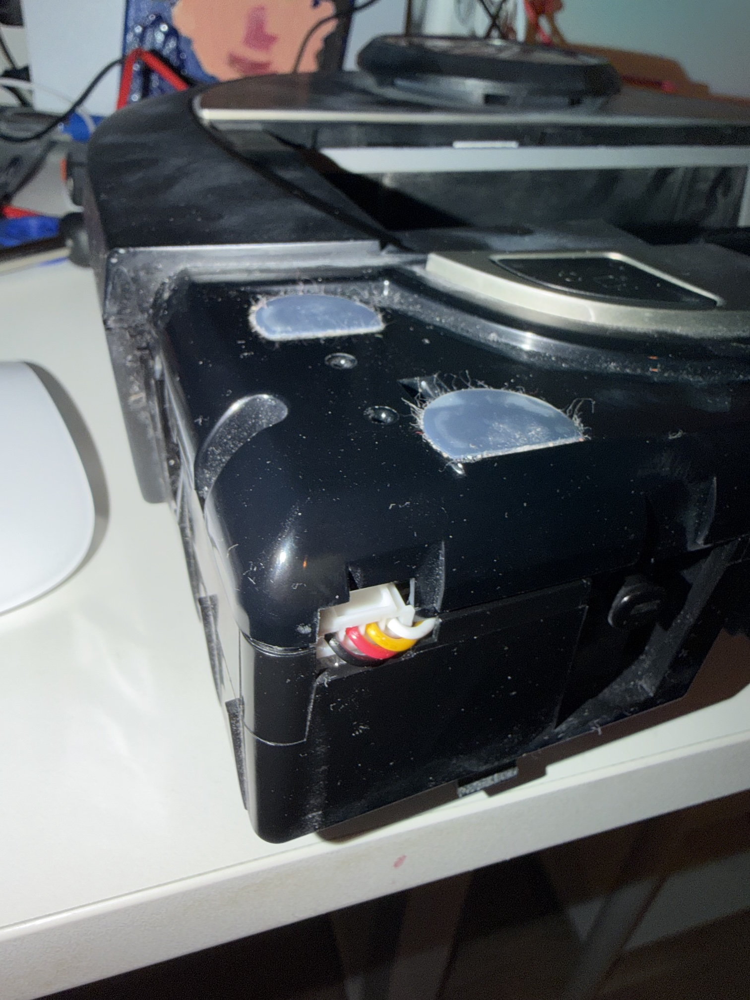

# User Guide

Everything you need to set up, configure, and troubleshoot OpenNeato.

## Table of Contents

- [Hardware Setup](#hardware-setup)
    - [What You Need](#what-you-need)
    - [Opening the Robot](#opening-the-robot)
    - [Debug Port Pinout](#debug-port-pinout)
    - [Wiring](#wiring)
- [Flashing Firmware](#flashing-firmware)
    - [Download](#download)
    - [Basic Usage](#basic-usage)
    - [What Happens Under the Hood](#what-happens-under-the-hood)
    - [Command Reference](#command-reference)
    - [Troubleshooting Flash Issues](#troubleshooting-flash-issues)
- [First-Time WiFi Setup](#first-time-wifi-setup)
    - [Serial Monitor](#serial-monitor)
    - [WiFi Configuration Menu](#wifi-configuration-menu)
    - [Verifying the Connection](#verifying-the-connection)
    - [Quick Commands](#quick-commands)
- [Troubleshooting](#troubleshooting)
    - [Enabling Logging](#enabling-logging)
    - [Collecting Logs](#collecting-logs)
    - [Downloading Cleaning Maps](#downloading-cleaning-maps)
    - [Factory Reset](#factory-reset)
    - [Reporting an Issue](#reporting-an-issue)
- [Multiple Robots](#multiple-robots)
- [Remote Access](#remote-access)

---

## Hardware Setup

> [!NOTE]
> Hardware assembly is not the primary focus of this project. There are already comprehensive
> teardown and wiring guides available — in particular
> [Philip2809/neato-brainslug](https://github.com/Philip2809/neato-brainslug) which covers
> the D3-D7 debug port in detail. This section shares my personal experience with minimal
> photos and a bill of materials. If there's community interest I'll expand it further —
> I'll be opening my own Neato D7 soon to replace the LIDAR O-ring.

### What You Need

| Item                                 | Price | Notes                                                                                                                                                                                                                   |
|--------------------------------------|-------|-------------------------------------------------------------------------------------------------------------------------------------------------------------------------------------------------------------------------|
| ESP32-C3 Super Mini (unsoldered)     | ~€3   | Get the variant **without pre-soldered pins**. You only need to solder the 4 pins for the debug port connection, which keeps the board compact. Search "ESP32-C3 Super Mini" on AliExpress — any ESP32-C3 variant works |
| JST XH 2.54mm 4-pin connectors       | ~€4   | Pre-crimped male/female pairs with 100mm wires. Search "Micro JST XH 2.54 4P connector" — comes in packs of 10 pairs, you only need one                                                                                 |
| T10 Torx security bit (tamper-proof) | ~€2   | 150mm long, needed to open the Botvac. Search "T10 tamper proof Torx bit 150mm"                                                                                                                                         |
| Soldering iron                       | ~€7   | Needed to solder the connector wires to the board. I picked up a cheap 80W adjustable-temp kit                                                                                                                          |
| Neato Botvac D3-D7                   |       | D8/D9/D10 are **not** supported (different board, password-locked serial port)                                                                                                                                          |

> [!TIP]
> I bought everything from AliExpress for under €16 total. Specific product listings come and
> go, so search by the descriptions above rather than relying on direct links.

> [!IMPORTANT]
> The ESP32 board must have **4 MB flash** (the standard for most dev boards). Boards with
> 2 MB flash are not supported — the dual OTA partition layout requires 4 MB.

Minimal soldering — just 4 wires to the board. If you're comfortable with a soldering iron,
solder the JST connector wires directly to the board pads for the cleanest result.

> [!TIP]
> If you're not confident in your soldering skills, here's a trick: insert the included header
> pins into the board holes alongside the wire tips so the pin squeezes the wire in place, then
> solder on top. The pin holds the wire steady and gives you a much easier target. The
> protruding pins also help anchor the board into EPE foam padding when you mount it inside the
> robot. That's what I did and it works fine.

The ESP32 is powered directly from the robot's 3.3V debug port — no separate USB power
supply needed during normal operation.

### Opening the Robot

<!-- TODO: brief description of my experience, photos of the bottom screws and top shell removal -->
<!-- Reference: https://github.com/Philip2809/neato-brainslug for a comprehensive teardown guide -->

### Debug Port Pinout

The debug port connector on Botvac D3-D7 has four pins (left to right when looking at the
connector):

```
┌──────────────────────────┐
│  RX  │ 3.3V │  TX  │ GND │
└──────────────────────────┘
```

These are the **robot's** RX/TX labels, so you cross-connect to the ESP32:

| Robot Pin | ESP32 Pin | Notes                        |
|-----------|-----------|------------------------------|
| RX        | ESP TX    | Robot receives data from ESP |
| 3.3V      | 3V3       | Powers the ESP32             |
| TX        | ESP RX    | Robot sends data to ESP      |
| GND       | GND       | Common ground                |

The default TX/RX GPIOs depend on the chip (ESP32-C3: GPIO 3/4, original ESP32: GPIO 17/16)
but are fully configurable from the web UI in **Settings -> Robot -> UART Pins** — so wire
whichever GPIOs are convenient and update the setting to match.

### Wiring

Connect the four JST XH wires between the robot's debug port and the ESP32.

> [!WARNING]
> Double-check the TX/RX crossover — swapping TX and RX is the most common wiring mistake.
> Robot RX goes to ESP TX, and Robot TX goes to ESP RX.

|             Wiring — wide angle              |             Wiring — side angle              |
|:--------------------------------------------:|:--------------------------------------------:|
|  |  |

|            Wiring — close-up            |         Wiring — cover closed, bumper removed         |
|:---------------------------------------:|:-----------------------------------------------------:|
|  |  |

I tucked the ESP32 under the mainboard and packed it with leftover EPE foam padding to keep it
from moving around. This means the USB port is no longer accessible — but that's fine since
OpenNeato has OTA updates with SHA-256 and MD5 integrity verification, so you never need
physical USB access again after the initial flash.

---

## Flashing Firmware

The flash tool (`openneato-flash`) is a standalone CLI that handles everything: port detection,
firmware download, integrity verification, and flashing. No Python, no esptool installation,
no manual steps.

### Download

Download the flash tool for your platform from the
[Releases](https://github.com/renjfk/OpenNeato/releases) page:

- `openneato-flash_Darwin_arm64` — macOS (Apple Silicon)
- `openneato-flash_Darwin_x86_64` — macOS (Intel)
- `openneato-flash_Linux_arm64` — Linux (ARM64, e.g. Raspberry Pi)
- `openneato-flash_Linux_x86_64` — Linux (x86_64)
- `openneato-flash_Windows_x86_64.exe` — Windows

These are standalone binaries — no extraction needed. On macOS/Linux you may need to
`chmod +x openneato-flash_*` first.

> [!TIP]
> On macOS, if you get a "cannot be opened because the developer cannot be verified" error,
> remove the quarantine attribute:
> ```bash
> xattr -d com.apple.quarantine ~/Downloads/openneato-flash_Darwin_arm64
> ```

> [!WARNING]
> The flash tool has been primarily tested on macOS. Linux and Windows builds are provided but
> not battle-tested — if you run into issues on those platforms, please
> [open an issue](https://github.com/renjfk/OpenNeato/issues).

### Basic Usage

Plug the ESP32 into your computer via USB and run:

```bash
openneato-flash
```

That's it. The tool will:

1. Auto-detect the ESP32's USB serial port
2. Detect the chip type (ESP32-C3, ESP32-S3, etc.)
3. Download the matching firmware from the latest GitHub release
4. Verify the download against `checksums.txt` (SHA-256)
5. Flash all partitions (bootloader, partition table, application) at 921,600 baud
6. Open a serial monitor at 115,200 baud for WiFi setup

### What Happens Under the Hood

**Port detection** — The tool scans USB serial ports by vendor ID. It recognizes Espressif's
native USB (`VID 303A`), plus common USB-UART bridges: CP210x (`VID 10C4`), CH340 (`VID 1A86`),
and FTDI (`VID 0403`). Espressif devices are marked with `*` in the port list.

**esptool** — The tool automatically downloads and caches the official `esptool` binary. You
don't need to install it separately. It's stored in your OS cache directory and reused on
subsequent runs.

**Firmware pack** — The downloaded `.tar.gz` contains everything needed to flash:

- `bootloader.bin` — First-stage bootloader
- `partitions.bin` — Partition table (dual OTA slots, LittleFS, NVS, coredump)
- `boot_app0.bin` — OTA boot selector
- `firmware.bin` — The application firmware (includes the embedded web UI)
- `offsets.json` — Flash addresses for each binary

**Integrity verification** — Before flashing, the tool downloads `checksums.txt` from the same
GitHub release and verifies the firmware archive's SHA-256 hash. If the hash doesn't match, the
tool refuses to flash.

### Command Reference

| Flag          | Default       | Description                                             |
|---------------|---------------|---------------------------------------------------------|
| `-port`       | auto-detected | Serial port path (e.g. `/dev/ttyUSB0`, `COM3`)          |
| `-chip`       | auto-detected | Chip type (e.g. `esp32-c3`, `esp32-s3`)                 |
| `-firmware`   | —             | Path to a local `.tar.gz` firmware pack; skips download |
| `-list`       | `false`       | List available serial ports and exit                    |
| `-no-monitor` | `false`       | Skip the serial monitor after flashing                  |
| `-monitor`    | `false`       | Open serial monitor only, don't flash                   |

> [!IMPORTANT]
> When using `-firmware` with a local firmware pack, place `checksums.txt` in the same
> directory as the `.tar.gz` file. The tool verifies SHA-256 before extracting and will
> refuse to flash if the checksums file is missing or the hash doesn't match.

### Troubleshooting Flash Issues

**"No USB serial ports found"** — Make sure the ESP32 is plugged in and your OS recognizes
it. Run `openneato-flash -list` to see what's detected.

**"Failed to detect chip"** — The ESP32 may not be in download mode. Try holding the BOOT
button while plugging in USB. If the issue persists, use `-chip` to skip detection
(e.g. `-chip esp32-c3` or `-chip esp32`).

**"Checksum mismatch"** — The downloaded firmware is corrupted. Re-run the tool to download
again. If using `-firmware`, make sure `checksums.txt` matches the archive.

**Permission denied on serial port** — On macOS, no extra permissions are usually needed. On
Windows, close any other serial monitor that might have the port open.

---

## First-Time WiFi Setup

After flashing, the tool opens a serial monitor where you'll configure WiFi.

### Serial Monitor

The serial monitor connects at 115,200 baud and shows the ESP32's boot output. You'll see
the boot banner:

```
========================================
  OpenNeato v0.1
========================================
  WiFi: not configured
  Press 'm' for menu, 's' for status
========================================
```

If WiFi is not configured, the configuration menu appears automatically.

### WiFi Configuration Menu

```
WiFi Configuration:
  [1] Scan WiFi networks
  [2] Enter SSID manually
  [3] Show current status
  [4] Reset all settings
```

**Option 1 — Scan WiFi networks**: Scans for up to 20 nearby networks and displays them
with signal strength (RSSI) and encryption type. Pick a network by number, then enter the
password (input is masked with `*`).

**Option 2 — Enter SSID manually**: Type the SSID and password directly. Useful for hidden
networks.

**Option 3 — Show current status**: Displays the current WiFi state — connected SSID, IP
address, MAC address, and signal strength.

**Option 4 — Reset all settings**: Factory reset — erases all saved settings including WiFi
credentials. Requires typing `YES` to confirm.

On successful connection, the ESP32 saves the credentials and restarts automatically. After
restart, the banner shows:

```
========================================
  OpenNeato v0.1
========================================
  WiFi: MyNetwork (192.168.1.42)
  Press 'm' for menu, 's' for status
========================================
```

### Verifying the Connection

Open a browser and navigate to:

- `http://neato.local` — mDNS hostname (configurable in Settings -> Network)
- `http://192.168.1.42` — use the IP shown in the serial monitor

You should see the OpenNeato dashboard. The robot status will show once the ESP32 is wired
to the debug port.

> [!NOTE]
> mDNS (`.local`) doesn't work on all networks — some routers block multicast traffic or
> resolve it differently. If `neato.local` doesn't work, use the IP address directly. You can
> find it in the serial monitor output or in your router's DHCP client list.

### Quick Commands

Once connected, you can type single-key commands in the serial monitor at any time:

| Key | Action                                  |
|-----|-----------------------------------------|
| `m` | Open WiFi configuration menu            |
| `s` | Print WiFi status (SSID, IP, MAC, RSSI) |

---

## Troubleshooting

If something isn't working as expected, use the built-in diagnostics tools to collect
information before creating an issue.

### Enabling Logging

Go to **Settings -> Diagnostics** and set **Log Level**:

- **Off** (default) — no events written to storage, zero flash wear
- **Info** — logs errors, timeouts, state transitions, boot, WiFi, OTA, NTP, cleaning events,
  and notifications. Auto-reverts to off after 1 hour.
- **Debug** — everything in Info plus all serial commands with raw responses. Auto-reverts to
  off after 10 minutes.

The raw serial console endpoint (`POST /api/serial?cmd=<command>`) for direct robot
communication is always available regardless of log level.

> [!NOTE]
> Logging writes to flash storage using LittleFS. Higher levels generate more writes, which
> increases flash wear and can slow serial communication as the filesystem fills up. Use Info
> or Debug only when actively diagnosing an issue.

### Collecting Logs

Go to **Settings -> Diagnostics -> Logs** to view all log files. The current session log
(`current.jsonl`) is listed first, followed by archived logs (newest first).

For each log file you can:

- **View** — tap the filename to see the contents in-browser
- **Download** — tap the download icon to save the `.jsonl` file
- **Delete** — tap the delete icon to remove individual files

To download all logs: use the individual download buttons for each file you need. When
reporting an issue, include at least the `current.jsonl` and any archived log files from the
time the problem occurred.

### Downloading Cleaning Maps

If a cleaning session produced unexpected results (missed areas, strange paths, early
termination), download the cleaning history session from **History**. Each session includes
the robot's recorded path rendered as a coverage map, along with stats like duration, distance,
area covered, and battery usage.

<!-- TODO: describe how to download/share the session data file for issue reports -->

### Factory Reset

Two ways to factory reset:

1. **From the web UI**: Settings -> Device -> Factory Reset. Type `RESET` to confirm.
2. **Hardware button**: Hold the BOOT button for 5 seconds (GPIO9 on ESP32-C3, GPIO0 on
   original ESP32). The ESP32 will erase all settings and restart.

> [!CAUTION]
> Both methods erase everything — WiFi credentials, settings, logs, and cleaning history.

> [!TIP]
> If you just need to clear logs and maps, use **Settings -> Device -> Format Storage** instead.
> This erases logs and cleaning maps but keeps your WiFi and settings intact.

### Reporting an Issue

Before creating an issue on GitHub:

1. **Set log level to Debug** (Settings -> Diagnostics -> Log Level -> Debug)
2. **Reproduce the problem** while logging is active
3. **Download the logs** (Settings -> Diagnostics -> Logs)
4. **If the issue involves cleaning**: download the relevant cleaning session from History
5. Create an issue at [github.com/renjfk/OpenNeato/issues](https://github.com/renjfk/OpenNeato/issues)
   and attach the log files

Include in your issue:

- Firmware version (visible on the Dashboard or Settings -> Firmware)
- Robot model (D3, D4, D5, D6, or D7)
- What you expected vs. what happened
- The log files from the time of the incident

---

## Multiple Robots

If you have more than one Botvac, flash a separate ESP32 for each robot and give them
unique hostnames via **Settings -> Network -> Hostname** (e.g. `neato-upstairs`,
`neato-downstairs`). Each device will be reachable at `http://<hostname>.local`.

> [!TIP]
> Add each robot's web UI to your phone's home screen for quick access. Since each has a
> different hostname, they'll show up as separate bookmarks.

---

## Remote Access

OpenNeato is a local-only device — it has no cloud component and doesn't expose anything to
the internet. If you want to access your robot while away from home, the simplest and most
secure approach is to set up a VPN to your home network.

I use a personal [WireGuard](https://www.wireguard.com/) VPN, which lets me reach the robot
(and everything else on my LAN) as if I were home. WireGuard is lightweight, fast, and easy to
set up on most routers or a Raspberry Pi.

> [!TIP]
> A home VPN solves remote access not just for OpenNeato but for all your local devices and
> services — NAS, printers, cameras, etc.
